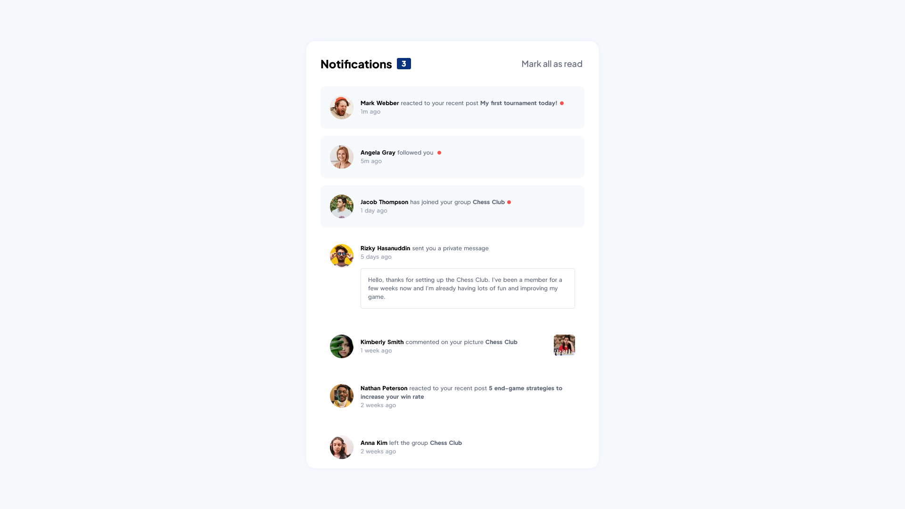

# Frontend Mentor - Notifications page solution

## Table of contents

- [Overview](#overview)
  - [The challenge](#the-challenge)
  - [Screenshot](#screenshot)
  - [Links](#links)
- [My process](#my-process)
  - [Built with](#built-with)
  - [What I learned](#what-i-learned)
  - [Continued development](#continued-development)
  - [Useful resources](#useful-resources)
- [Author](#author)

## Overview

### The challenge

Users should be able to:

- Distinguish between "unread" and "read" notifications
- Select "Mark all as read" to toggle the visual state of the unread notifications and set the number of unread messages to zero
- View the optimal layout for the interface depending on their device's screen size
- See hover and focus states for all interactive elements on the page

### Screenshot



### Links

- Solution URL: https://github.com/nidalA1992/notification-page-main-vue
- Live Site URL: https://nidala1992.github.io/notifications-page-main

## My process

### Built with

- [Vue](https://vuejs.org/) - JS library

### What I learned

Base Vue template syntax

Conditional and list rendering
```vue
<!--conditional-->
<a v-if="commentedPicture" href="#" class="commented-link">
<!--list-->
<li v-for="notification in notifications" :key="notification.id">
```
Computed props and Reactive data
```js
// computed
const amount = computed(() =>
        notifications.reduce((amount, item) => (item.unread ? ++amount : amount), 0)
);
// reactive
const notifications = reactive(data);
```
Slots
```vue
<!--define slot-->
<template>
  <header class="header">
    <h2 class="title">Notifications</h2>
    <notification-counter :amount="amount" />
    <slot />
  </header>
</template>
<!--use slot-->
<app-header :amount="amount">
  <button @click="t" class="button">Mark all as read</button>
</app-header>
```

### Continued development

Learning Vue
### Useful resources

- [Official Vue documentation](https://vuejs.org)

## Author

- Frontend Mentor - [nidalA1992](https://www.frontendmentor.io/profile/nidalA1992)